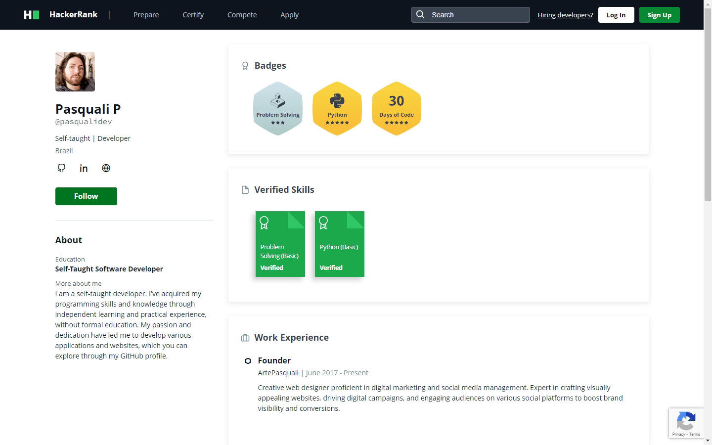

# Multilanguage README Choose your language

 

<h1 align="center">
  💻 Practice coding skills, prepare for interviews.
</h1>

<h4 align="center"><a href="https://www.hackerrank.com/pasqualidev">Click to visit my profile</a></h4>

# HackerRank

This is a collection of my HackerRank solutions written in Python3. The goal of this series is to keep the code as concise and efficient as possible. It might not be perfect due to the limitation of my ability and skill, so feel free to make suggestions if you spot something that can be improved.

---

## 📚 Practicing skills.

Some skills I practice and write solutions for.

-   Python3;
-   JavaScript;

---

<h2>🦄 Autor</h2>

<table>
  <tr>
    <td align="center">
      <a href="https://github.com/PasqualiRafael">
         
        
          <b>Pasquali</b>
        
      </a>
    </td>
  </tr>
</table>
